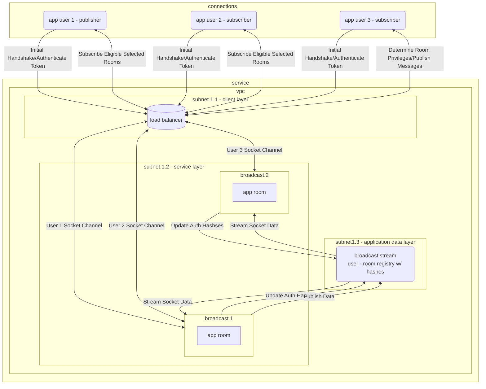

# broadcast

### a secure, authenticated room based broadcast messsage broadcast service

## overview

Broadcast is a service that allows for real time, secure websocket connections. The underlying service utilizes the socket.io node.js (redis-streams-adapter)[https://socket.io/docs/v4/redis-streams-adapter/]. The implementation focuses on a few separate key features that should contribute to overall user experience:

 1. high availability and fault tolerance
 2. secure and authenticated client connections
 3. high performance and horizonatally scalable

## design

