# Design

### overhaul of entire sight platform to support a modern backend with a simplified user experience

## infrastructure

```mermaid
graph TD;
subgraph "connections"
  client(app user)
end


subgraph "client data sources"
  extds[(external datasource)]
end

subgraph "sight"  

  subgraph "cloud"
    subgraph "entry"
      dns(dns)
      glb[(global load balancer<br/>e.g., Route 53)]
    end

    subgraph "s3"
      s3.processors[(bucket<br />task runner processor files)]
    end
  end

  subgraph "internal"
    subgraph "vpc.1"
      subgraph "subnet.1.1 - client layer"
        ilb.1[(internal load balancer)]
      end

      subgraph "subnet.1.2 - service layer"      
        subgraph "sight.1 - docker-compose"
          frontend.1(frontend<br /> vue.js static files<br />served by nginx)

          gateway.1(auth/account - primary<br />node.js process)
          search.1(search/model - primary<br />node.js processs)

          taskrunner.1(task runner - primary<br />node.js process)
        end
      end

      subgraph "subnet1.3 - application data layer"
        etcd.1[(etcd primary)]
        appDb.1[(mongoDb primary)]
      end
    end

    subgraph "vpc.2"
      subgraph "subnet.2.1 - client layer"
        ilb.2[(internal load balancer)]
      end

      subgraph "subnet2.2 - service layer"
        subgraph "sight.2 - docker-compose"
          frontend.2(frontend<br /> vue.js static files<br />served by nginx)
          
          gateway.2(auth/account - secondary<br />node.js process)
          search.2(search/model - secondary<br />node.js process)
          taskrunner.2(task runner - secondary<br />node.js process)
        end
      end

      subgraph "subnet2.3 - application data layer"
        etcd.2[(etcd secondary)]
        appDb.2[(mongoDb secondary)]
      end
    end

    subgraph "vpc.3"
      subgraph "subnet.3.1 - client layer"
        ilb.3[(internal load balancer)]
      end

      subgraph "subnet3.2 - service layer"
        subgraph "sight.3 - docker-compose"
          frontend.3(frontend<br /> vue.js static files<br /> served by nginx)
          
          gateway.3(auth/account - secondary<br />node.js process)
          search.3(search/model - secondary<br />node.js process)
          taskrunner.3(task runner - secondary<br />node.js process)
        end
      end

      subgraph "subnet3.3 - application data layer"
        etcd.3[(etcd secondary)]
        appDb.3[(mongoDb secondary)]
      end
    end
  end

end

client <-->|Request/Response| glb

dns <-->|Binds| glb

glb <-->|Routes| ilb.1
glb <-->|Routes| ilb.2
glb <-->|Routes| ilb.3

frontend.1 <-->|Serves| ilb.1

gateway.1 <--> |Routes| ilb.1
gateway.1 -->|Queries| appDb.1

search.1 <--> |Routes| ilb.1
search.1 -->|Queries| appDb.1
search.1 -->|Queries| extds

taskrunner.1 <-->|Campaigns| etcd.1
taskrunner.1 -->|Queries| appDb.1
taskrunner.1 -->|Fetches Files| s3.processors
taskrunner.1 -->|Allocates Task| taskrunner.1

frontend.2 <-->|Serves| ilb.2

gateway.2 <-->|Routes| ilb.2
gateway.2 -->|Queries| appDb.2

search.2 <-->|Routes| ilb.2
search.2 -->|Queries| appDb.2
search.2 -->|Queries| extds

taskrunner.2 <-->|Campaigns| etcd.2
taskrunner.2 -->|Idles| taskrunner.2

frontend.3 <-->|Serves| ilb.3

gateway.3 <-->|Routes| ilb.3
gateway.3 -->|Queries| appDb.3

search.3 <-->|Routes| ilb.3
search.3 -->|Queries| appDb.3
search.3 -->|Queries| extds

taskrunner.3 <-->|Campaigns| etcd.3
taskrunner.3 -->|Idles| taskrunner.3

etcd.1 <-->|Replicates| etcd.2
etcd.1 <-->|Replicates| etcd.3
etcd.2 <-->|Replicates| etcd.3

appDb.1 <-->|Replicates| appDb.2
appDb.1 <-->|Replicates| appDb.3
appDb.2 <-->|Replicates| appDb.3
```

## overview

`sightv2` revamps the backend architecture with a nod towards horizontal scaling and redundancy, as well as security. The system can be siloed off in its own Virtual Private Cloud (VPC), with the only external facing attack vector being the external load balancer. This will most likely be set up using a solution like `AWS Route 53`, which will also be linked to the DNS system with the public facing url for `sightv2`. Internally, a load balancer will connect to the the external load balancer and distribute requests from clients to the internal services. Services are separated into distinct layers in the VPC and will have their own subnets to ensure another layer of defense in the situation where an attacker is able to get through the external load balancer. 

### redundancy for fault tolerance

### separation of concern within vpcs

The first layer is the service layer, which will include n number of servers, most likely basic `ec2` instances or even `ecs` containers if moving over to kubernetes. Initially though, each `ec2` instance should be configured multi-core, with all services running under `docker-compose` on each instance. Each service will be replicated on each server, with each function/route essentially running in its own process. Included in this container enviroment will be an internal load balancer, most likely `haproxy`, that will redirect requests based on the endpoint a user interact with, n number of `nginx` containers serving the frontend to the client, n number of gateway `nodejs` servers that handle authentication and account management, and n number of search `nodejs` servers, which handle query data sources and managing data sources. Authentication is currently internal, with `jwt` serving as auth token when handling requests. This will be a tempory solution until `OAuth` is implemented. All routes are authenticated on each request to ensure that users can only access data that they own or have the authority to view.

The second layer is the application data layer, which is running two distinct services, which are `etcd` and `mongodb`. etcd is a distributed key-value store that can be utilized to build fault-tolerant, distributed systems. In `sightv2`, `etcd` serves as both a distributed cache layer and the consensus module, while `mongodb` serves as the storage layer for all application schemas, including user accounts, data sources, and saved searches. 

The third layer is the internal data layer, which runs a `mongodb` cluster that contains internal configs and bootstraps for systems. This segregation ensures that confidential machine configurations do not get leaked in the case an attacker gets into the vpc. On initial startup of new systems, the newly added machines will query the instance for up to date configurations to get started, including endpoints and credentials for connecting to the application database and the etcd cluster for replication. It will also be able to see a registry of other systems. Each process will periodically take a snapshot of system health, as well as statistics, and log them here.

The service layer can communicate with the application and internal data layers, but neither can communicate with the service layer, and only systems in the cluster on the service layer will be allowed to communicate with the services on the data layers. Each system will be copied at least 3 times to ensure fault tolerance in the instance that a system fails or has a network partition, and should be able to survive 1 failure within each cluster (so services can have up to 1 failure with 3 nodes, etcd can have the same, and mongodb can have the same). `sightv2` aims to provide a user experience where if any single component fails within the system that it will not cause the entire application to become unavailable. On initial startup, the service systems will attempt to make a connection to both `etcd` and `mongodb`. On `etcd`, the systems will register themselves and then start a campaign. Once a new leader is elected, it becomes the primary node that serves client requests, while the other service nodes become fallback until the primary encounters a failure. Each node will maintain its connection to `etcd` and send heartbeats as a way to maintain system health. Each node will also connect to `mongodb`, but only the primary server in the cluster will make queries. Requests that reach other nodes that are not primary are rerouted to the primary to be processed. The frontend's static files can be served from any system.

The service layer also runs an independet `node.js` process called task runner, which is a service for developers and data engineers to build automated queries and post-processing logic. To create these, the client would first have to create a saved search from a successful search query. They would then define the metadata for the task, including the name, description, lifecycles. The client will then be prompted to upload a processor file, which is a typescript or javascript.

The above diagram simplifies the topology to all services being primary on a single system, however, different services can be elected on different systems since it not per system but instead per service. This could be set to enforce that no more than one process is allowed to run on any given system, which would more evenly distribute work amongst machines. Each service could even be split up into individual functions, where then each system would serve a single function. However, the above two services contain a few different functions that are related, and logically groups them together. This will mitigate making unnessarry and wasteful redirects.