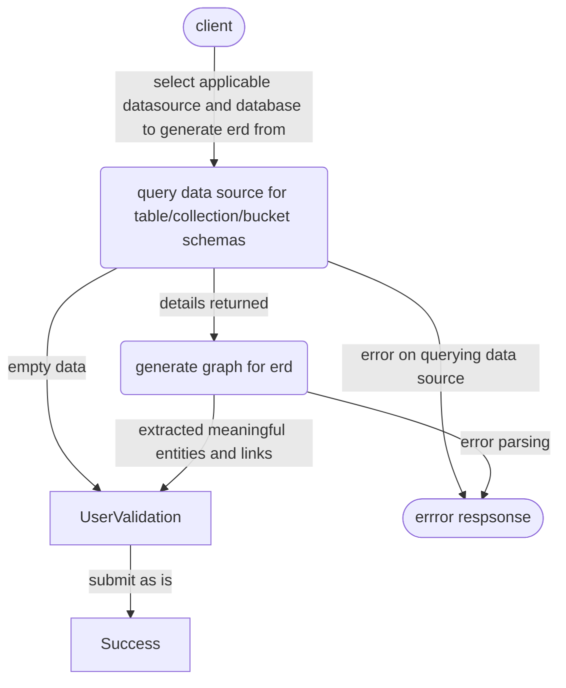
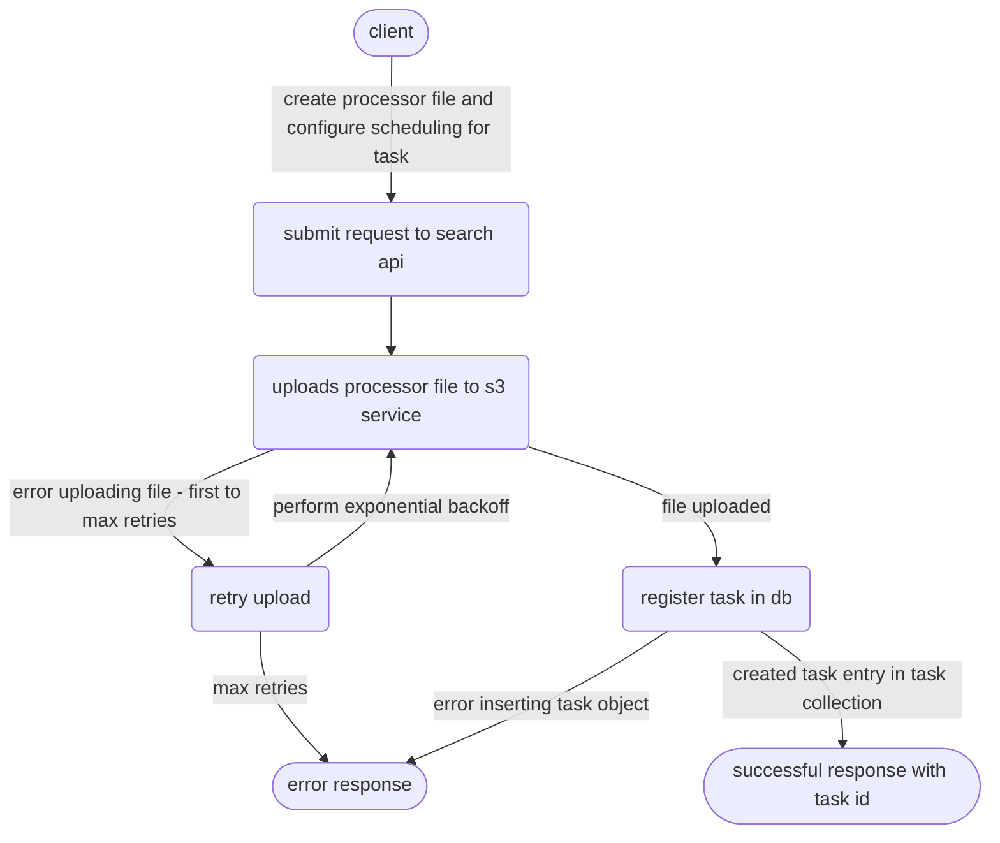

# workflows

## model

1. generate model

```mermaid
flowchart TB
  GenerateModel([client]) -->|select applicable datasource and database to generate erd from| QueryMetadata

  QueryMetadata(query data source for table/collection/bucket schemas) -->|details returned| ParseResults
  QueryMetadata -->|empty data| UserValidation
  QueryMetadata -->|error on querying data source| Error

  ParseResults(generate graph for erd) -->|extracted meaningful entities and links| UserValidation
  ParseResults -->|error parsing| Error

  UserValidation -->|submit as is| Success


  Success
  Error([errror respsonse])

```

2. submit model

## search

## task runner

### workflows

#### create task

```mermaid
flowchart TB
  CreateTask([client]) -->|create processor file and configure scheduling for task| SubmitRequest
  
  SubmitRequest(submit request to search api) --> UploadProcessorFile
  UploadProcessorFile(uploads processor file to s3 service) -->|error uploading file - first to max retries| Retry
  UploadProcessorFile -->|file uploaded| RegisterTask

  Retry(retry upload) -->|perform exponential backoff| UploadProcessorFile
  Retry -->|max retries| Error

  RegisterTask(register task in db) -->|created task entry in task collection| Success
  RegisterTask -->|error inserting task object| Error

  Success([successful response with task id])
  Error([error response])
```